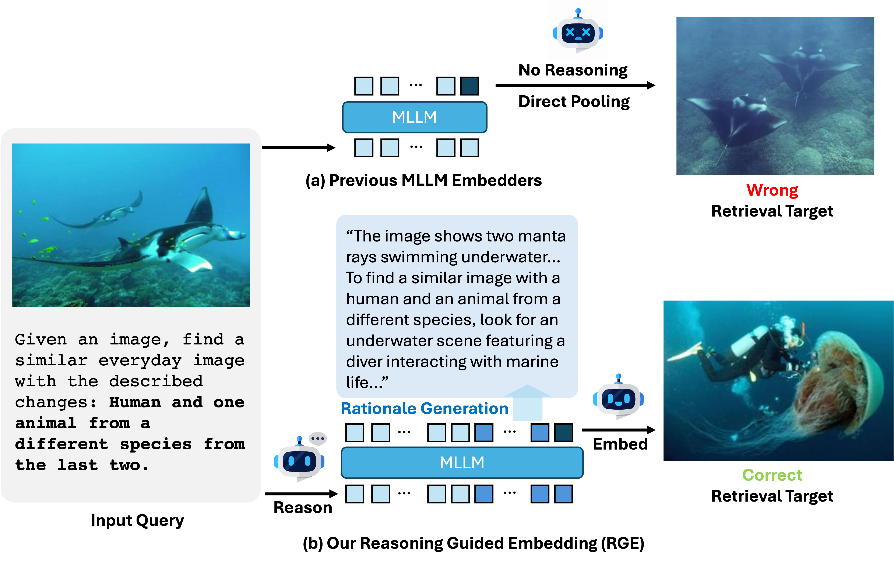
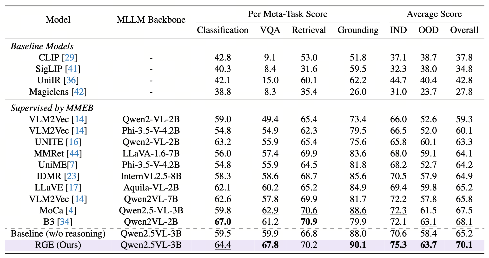

# 
Reasoning Guided Embeddings: Leveraging MLLM Reasoning for Improved Multimodal Retrieval

<p align="center">
      <a href="https://scholar.google.com.hk/citations?user=dvUKnKEAAAAJ&hl=en" target='_blank'>Chunxu Liu</a>,&nbsp;
      <a>Jiyuan Yang</a>,&nbsp;
      <a href="https://scholar.google.com.hk/citations?user=VNSP2hMAAAAJ&hl=en" target='_blank'>Ruopeng Gao</a>,&nbsp;
      <a href="https://scholar.google.com/citations?user=ydgR3LgAAAAJ&hl=en" 
      target='_blank'>Yuhan Zhu</a>,&nbsp;
      <a href="https://scholar.google.com/citations?user=oO53gjEAAAAJ&hl=en" target='_blank'>Feng Zhu</a>,&nbsp;
      <a href="https://scholar.google.com/citations?user=1c9oQNMAAAAJ&hl=en" target='_blank'>Rui Zhao</a>,&nbsp;
      <a href="https://scholar.google.com.hk/citations?user=HEuN8PcAAAAJ&hl=en" target='_blank'>Limin Wang</a>,&nbsp;
    <br>
  Nanjing University, &nbsp; SenseTime Research
  </p>

<p align="center">
  <a href="https://arxiv.org/abs/2511.16150" target='_blank'>
    
  </a> 
  <a href="https://huggingface.co/lcxrocks/RGE" target='_blank'>
    
  </a>
</p>

## Overview

**TL; DR.** We introduce **R**easoning **G**uide **E**mbedding (**RGE**) model, which takes advantage of MLLMs’ structured reasoning during embedding extraction, using generated rationales with contrastive training to produce more context-aware representations, improving embedding quality.



We propose Reasoning Guided Embeddings (RGE), which explicitly incorporates a model’s generative reasoning into the embedding extraction process. RGE first prompts the MLLM to produce structured rationales conditioned on the instruction. After the reasoning unfolds, the model extracts embeddings enriched with context-dependent inference signals. Experiments on the MMEB benchmark show that this reasoning guided approach significantly boosts retrieval performance.

## Environment Setup
Please make sure the `transformers` version is compatible. 

```commandline
conda create -n sorce python=3.11
pip install -r requirements.txt
```

## Evaluation Dataset Preparation
Please download MMEB evaluation [Hugging Face](https://huggingface.co/datasets/TIGER-Lab/MMEB-eval/).

```commandline
mkdir datasets
huggingface-cli download --repo-type dataset --resume-download TIGER-Lab/MMEB-eval --local-dir ./datasets/MMEB-eval
```


## Evaluation
To evaluate the model, please first download [MMEB evaluation dataset](https://huggingface.co/datasets/TIGER-Lab/MMEB-eval/) and our model at [🤗hugginface pretrained model](https://huggingface.co/lcxrocks/RGE/):

```commandline
huggingface-cli download --resume-download lcrocks/RGE --local-dir ./models/RGE
huggingface-cli download --repo-type dataset --resume-download TIGER-Lab/MMEB-eval --local-dir ./datasets/MMEB-eval
```

After downloading the evaluation dataset and model, please run the following command for evaluation.

```commandline
bash scripts/evaluate.sh
```


## Experiment Results:




## Citation


If you think this project is helpful in your research or for application, please feel free to leave a star⭐️ and cite our paper:


```

@misc{liu2025reasoningguidedembeddingsleveraging,
      title={Reasoning Guided Embeddings: Leveraging MLLM Reasoning for Improved Multimodal Retrieval}, 
      author={Chunxu Liu and Jiyuan Yang and Ruopeng Gao and Yuhan Zhu and Feng Zhu and Rui Zhao and Limin Wang},
      year={2025},
      eprint={2511.16150},
      archivePrefix={arXiv},
      primaryClass={cs.CV},
      url={https://arxiv.org/abs/2511.16150}, 
}

```

## License and Acknowledgement
This project is released under the Apache 2.0 license. 
The codes are based on [MoCa](https://github.com/haon-chen/MoCa/tree/main).
Please also follow their licenses. Thanks for their awesome work!

We also thank all contributors to this project and [Qingyun](https://github.com/Li-Qingyun) for the valuable discussions!